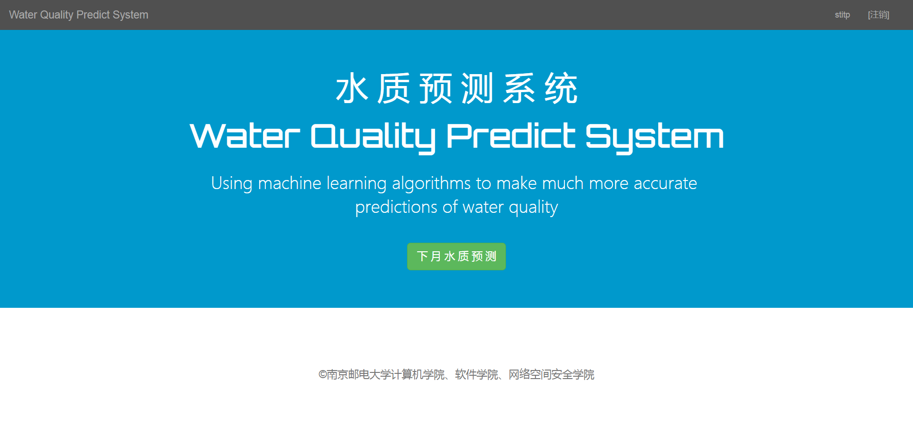
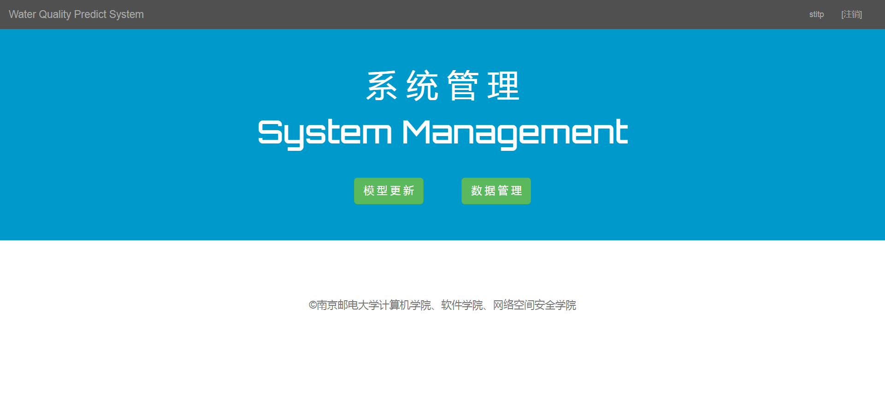
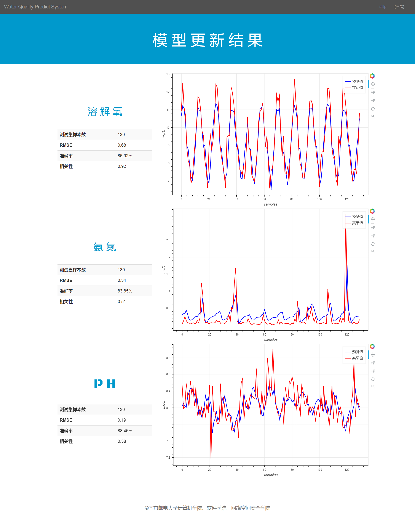
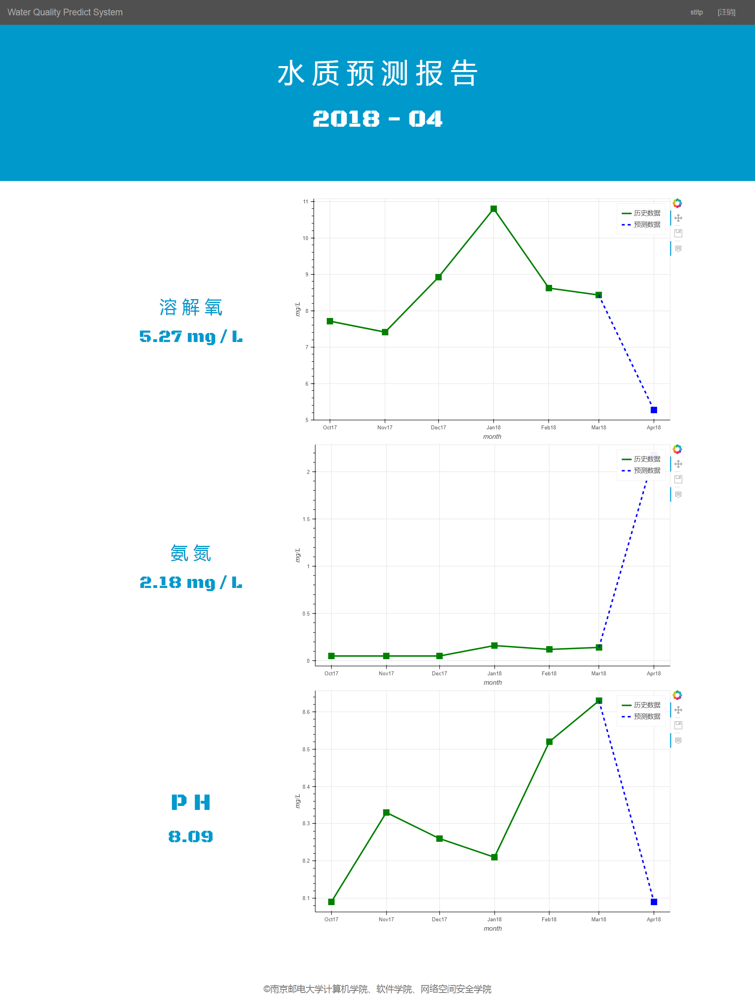

# 水质预测系统

## 概述

将BP、RNN、SVM等机器学习算法应用于水质预测，预测出PH、溶解氧和氨氮等水质指标数值，精准度在90%以上。算法层面不过多阐述，主要是上述几种机器学习算法的集成。由于要写论文和申专利，这里只应用了SVM算法，精度也接近90%。本系统采用Django实现。

## 系统功能

+ 利用前三个月的水质数据，进行下月的水质预测
+ 自动生成可交互式的预测图表用于展示
+ 管理员能手动更新预测模型并管理水质数据

## 系统效果

### 主页



### 管理员界面



### 模型训练界面



### 预测界面



## 运行方式

+ 将仓库克隆到本地

  ```c
  git clone https://github.com/sctpan/WaterQualityPredictSystem.git
  ```

+ 进入manage.py同级目录，安装依赖

  ```c
  pip install -r requirements.txt
  ```

+ 移植数据库

  ```c
  python manage.py migrate
  ```

+ 运行程序

  ```c
  python manage.py runserver
  ```

+ 使用浏览器打开http://127.0.0.1:8000/